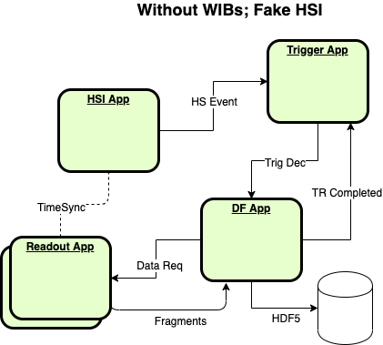

Here is a diagram of a simple system that is supported in dunedaq-v2.6.0.  It uses 'fake' sources to emulate the behavior of the FELIX and HSI electronics.  

*** 

Here is a diagram of a slightly different simple system that also uses emulators instead of real electronics.  This diagrams shows some of the internal details of the processes, especially the DAQModules and queues between them.

